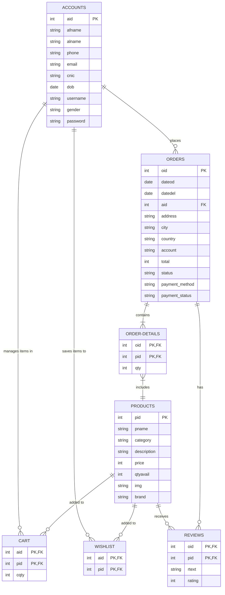
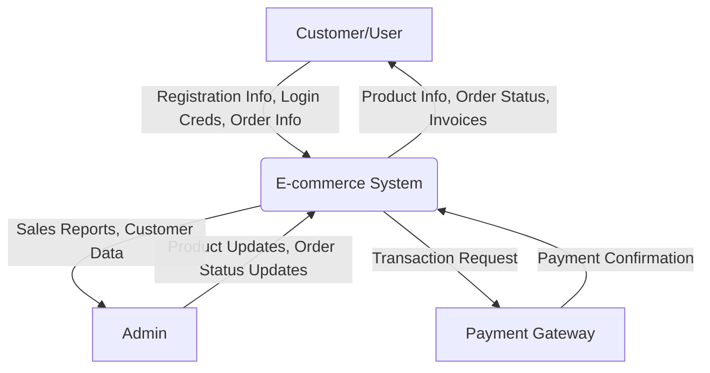
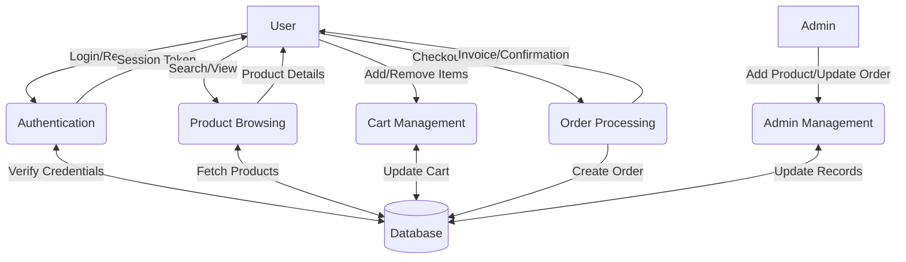

# Project Documentation: ERD and DFD

## 1. Entity Relationship Diagram (ERD)

The following diagram represents the Entity Relationship Diagram for the project. It shows the entities (tables) and their relationships within the database.

### ERD Visual Description (Mermaid)

### Table Descriptions

1.  **ACCOUNTS**: Stores user information (customers and admins).
2.  **PRODUCTS**: Contains details about items available for sale.
3.  **ORDERS**: Records order transactions, delivery details, and status.
4.  **ORDER-DETAILS**: Maps products to specific orders with quantities.
5.  **CART**: Temporary storage for products a user intends to buy.
6.  **WISHLIST**: Stores products saved by users for later.
7.  **REVIEWS**: Holds user feedback and ratings for ordered products.

---

## 2. Data Flow Diagram (DFD)

The Data Flow Diagram (DFD) maps out the flow of information for any process or system. It uses defined symbols like rectangles, circles, and arrows to show data inputs, outputs, storage points, and the routes between each destination.

### DFD Level 0 (Context Diagram)

This diagram shows the system boundaries and interactions with external entities.

### DFD Level 1 (Process Breakdown)

This diagram breaks down the main system into specific subprocesses.

### Process Descriptions (Level 1)

1.  **Authentication**: Handles user signup, login, and session management. Verifies credentials against the `accounts` table.
2.  **Product Browsing**: Allows users to view products by category or search. Fetches data from the `products` table.
3.  **Cart Management**: Users add or remove items. Updates the `cart` table.
4.  **Order Processing**:
    *   Validates cart items.
    *   Calculates totals.
    *   Processes payment (Stripe/bKash/COD).
    *   Creates records in `orders` and `order-details`.
    *   Updates product inventory in `products`.
5.  **Admin Management**: Admin users manage inventory, update order statuses (e.g., Shipped, Delivered), and view customer data.
